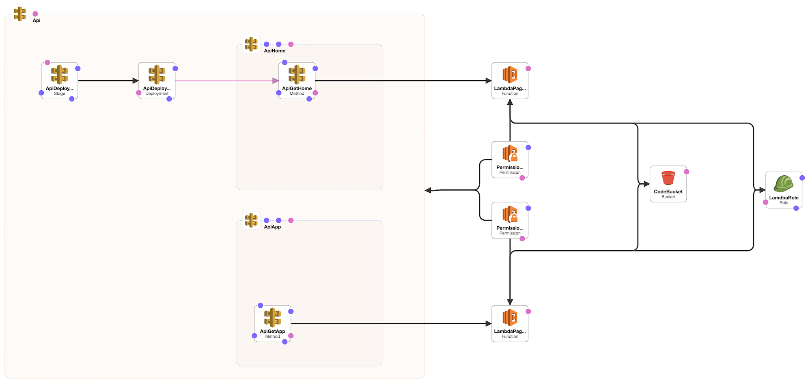

## HTML Pages using CLJS Lamdbdas

Using *proxy* Lamdbas, it's possible for the API Gateway to expose a Lamdba as an html page.

This technique is used to create logged-in and logged-out html pages using the Cognito pool created by the AppSync stack.

## Installation

To complete these steps you will need some data from the Cognito User Pool:

* pool id
* domain
* app client id
* app client secret

Now you are ready to create the pages. `<stack name>` in the steps below is a name you choose for this new Cloudformation stack.

1. generate the Cloudformation files `lein run -m crucible.encoding.main`
2. create the Cloudformation stack `./scripts/install.sh <stack name> <aws region> <cognito pool id> <cognito domain> <cognito client id> <cognito client secret>`
   Important: use the AWS console or `aws cloudformation describe-stacks --region <aws region> --stack-name <stack name>` to allow the stack creation to complete before moving to step #3.
3. `npm install`
4. generate and deploy the Node.js code `./scripts/update-lambdas-js.sh <stack name> <aws region>`

If all steps succeeded, you can now deploy the API Gateway to the *dev* stage which was created by the stack.

Then click on the URL for the deployed API and add */home* to the address bar in the browser to test the home page.
The *Website Home Page* should now be displayed. Now you can enable the authentication flow by:

1. Copy the URL from the browser address bar
2. In the AWS Console, Navigate to your Cognito User Pool / App Client Settings
3. Paste the URL into the *Sign out URL(s)* field
4. Paste the URL into the *Callback URL(s)* field and change the uri to */app* instead of */home*
5. Save the changes and try login in the browser (you will need to register/create a Cognito user)

That's it! You have a full login/logout application using Cognito and Node.js.

## Development

There are basic tests for the Node.js pages using *shadow-cljs* auto-testing

You should read the [Shadow CLJS docs](https://shadow-cljs.github.io/docs/UsersGuide.html)

1. start the test watcher `./node_modules/.bin/shadow-cljs watch :test` or `./node_modules/.bin/shadow-cljs compile :test`
2. make changes to the source or tests and see the watcher re-compile/run
3. if you are changing the html views, use the previews in *out/views* to see your changes

If you want to change the stack e.g. add a new page then:

1. change the *cf.node-pages.clj* source
2. re-generate the Cloudformation files `lein run -m crucible.encoding.main`
3. update the Cloudformation stack `./scripts/update-stack.sh <stack name> <aws region> <cognito pool id> <cognito domain> <cognito client id> <cognito client secret>`

If you want to change the pages then:

1. change the *pages.handlers.cljs* or *pages.views.cljs*
2. re-deploy the Node.js code `./scripts/update-lambdas-js.sh <stack name> <aws region>`
3. test the page. It's not required to do an API Gateway *deploy* when updating Lambda code

Note: if you are adding a new page/uri then don't forget to add it to the *update-lambdas-js.sh* file.

If you want to run these scripts in a CI/Docker image then use `steveb8n/cljs-node-aws-cli` to have all the CLI tools available.

## Design

Figure 1: Cloudformation Stack

The Crucible/Cloudformation template creates the stack above. It contains:

* 2 CLJS Lambdas which read thier code from a *CodeBucket*
* A role to allow the Lambdas to run
* 2 permissions for the API Gateway to invoke the Lambdas
* 2 resources with GET methods linked to the Lambdas
* A *dev* deployment stage, ready for you to publish the API

Why CLJS for pages? Fast cold starts!

Even though Ions have slow cold starts, this will probably improve in future.
On that basis, using Node.js for server pages that don't use Ion/Datomic is a good design for a fast UX.

Also, when using the Solo Cloud, there will be downtime when deploying new Ions because there's only one node.
Using a separate Lamdba to generate an html page allows your app to show html to the user while waiting for
the cold starting node to respond.

Why Shadow-CLJS?

Shadow CLJS makes npm library use very simple. Since these pages use Node.js, it's a good fit.

## Roadmap

* Store Cognito JWT in Datomic and use a cookie to retrieve it.
Avoids needing to pass the JWT as a URL parameter to logged-in pages.
* Validate the JWT token before using it (see validate-token fn in handlers.cljs)
* use a tools.cli fn instead of bash scripts and read the Cognito data instead of using CLI args
* Investigate if IAM roles can allow Lambdas to exchange code for token (instead of TOKEN endpoint and needing id/secret in env)
